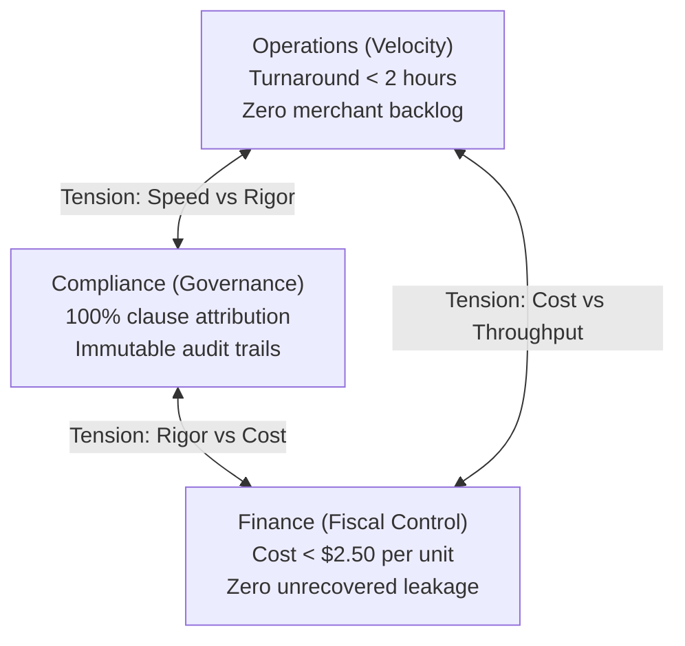
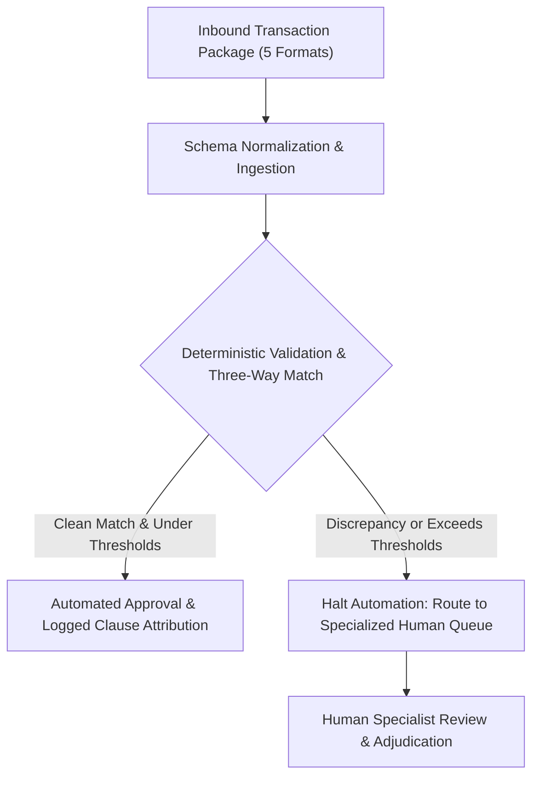

# Unit 0.1: Meet the client: OmniSupply Operations

You are being hired to fix an operations breakdown, not to run an experiment with language models. This unit introduces the business reality, the raw operating metrics, and the conflicting leadership constraints that every subsequent technical phase builds against.

::: phase learn

## The solution-first trap

Most enterprise automation projects fail before a single line of software is written. The failure pattern is almost always the same: an engineering team hears a high-level complaint from operations, jumps immediately to model selection, and starts drafting text prompts.

```text
The Solution-First Trap:
Complaint: "Disputes take three days to resolve."
Premature Response: "We will deploy a multi-agent framework with vector search."
Result: Unchecked errors, unverified credits, and project cancellation.
```

Technical vocabulary describes tools, not business operations. When you open a project by pitching multi-agent swarms, vector embeddings, and semantic reasoning, you commit two critical mistakes. First, you choose an architecture before identifying the physical workflow breakdown. Second, you forfeit the ability to diagnose root causes: when a deployed system invents an unauthorized credit memo, runs over budget, or drops records under load, you cannot determine whether the prompt was inadequate, the model hallucinated, or you simply misunderstood the intake process on day one.

> **Gotcha: The solution-first reflex**
> When asked to summarize a client problem, junior practitioners reflexively name a technology: "the client needs an AI agent to read invoices." That is an implementation guess, not a problem statement. The operational problem is: "the client processes 4,000 multi-format records a month with a three-day manual backlog that consumes 60% of specialist capacity and leaks margin through unverified credits." Always state the business friction before naming any computational tool.

Before proposing any technical architecture, you must answer four fundamental operational questions in plain language:

1. What physical and digital artifacts arrive, in what formats, and at what daily volume?
2. Who inspects them, what internal databases do they cross-reference, and what decision do they make?
3. What does an erroneous, incomplete, or delayed decision cost the business?
4. What specific numerical metrics do leadership stakeholders inspect at month end?

Once you can answer these four questions without using the words "AI", "LLM", "agent", or "model", the true system requirements reveal themselves. You can see where input validation must be deterministic, where optical extraction is required, where database cross-referencing must occur, and where human specialists must retain decision authority.

> **Predict, then check.** An engineer builds a prototype prompt that reads invoice text and outputs adjustment recommendations. In testing on ten clean digital PDF files, it generates reasonable credit numbers. The engineer deploys it to live intake. On day two, a loading dock worker uploads a blurry cell-phone photograph of a crumpled paper packing slip with grease stains over the SKU column and handwritten delivery notes.
>
> What does the standalone prompt do, and what does it cost the business?

The standalone prompt fails silently. It does not crash or raise an exception. Instead, it reads the garbled characters, hallucinates plausible product codes from its training memory, and recommends an unverified $450 credit memo. Because the pipeline lacks deterministic schema validation and contract grounding, the adjustment posts straight to the accounts payable ledger. Three months later, the supplier audits the transaction, rejects the deduction, and assesses a penalty. The failure was not a bad prompt: the failure was deploying a model without an operational verification boundary.

## The Enterprise Stakeholder Trilemma

Every business workflow sits inside an operational trilemma where three leadership roles enforce mutually contradictory definitions of success. Pleasing any single stakeholder while neglecting the other two breaks the business.



### Three competing definitions of done

At OmniSupply Operations, three distinct leaders evaluate your system. Each holds veto power over production deployment.

The **Operations Manager (Sarah Jenkins)** owns turnaround speed and queue capacity. She wants dispute triage latency cut from three business days to under two hours, with all inbound dispute and billing records indexed and tracked within 15 minutes of receipt. When retail merchant partners wait days for a credit memo on damaged stock, they withhold payment on entire five-figure account balances or switch to competing distributors. A system that achieves complete legal accuracy but takes four days to verify a claim fails her scorecard.

The **Compliance Officer (Kendra Brooks)** owns auditability and contractual governance. She demands an immutable audit trail with verbatim supplier contract clauses behind every price adjustment and return credit. A system that resolves claims in five seconds by generating plausible credit amounts without citing specific contract sections creates regulatory and legal exposure she will reject immediately.

The **Chief Financial Officer (Julian Thorne)** owns unit economics and gross margin protection. He requires back-office processing costs held strictly below $2.50 per transaction, with total monthly operational infrastructure expense capped below $10,000 and zero automated financial settlements over $1,000 without controller sign-off, alongside aggressive recovery of contractual volume rebates and supplier overbilling. A system that achieves rapid turnaround and audit compliance by burning $35 in computational inference per invoice will be terminated within a quarter.

::: aside Can a single prompt balance the trilemma?
No. A prompt is a natural language instruction to a statistical token generator. It has no awareness of computational unit cost, cannot enforce deterministic schema validation, and cannot guarantee regulatory compliance across thousands of transactions. Balancing the trilemma requires an orchestrated pipeline: deterministic validation filters bad input at low cost, structured grounding matches contract terms, and quantitative routing boundaries escalate ambiguous records to human specialists.
:::

### Why single-stakeholder optimization breaks the business

Attempting to solve the trilemma by prioritizing one stakeholder destroys the operational balance of the enterprise:

- **Optimizing only for Operations (Velocity):** You implement aggressive straight-through approvals to clear the queue. Claims under $300 are credited instantly without verifying supplier warranty agreements. Compliance halts the deployment during the first quarterly audit for undocumented deductions, and Finance discovers thousands of dollars in unrecoverable credit leakage.
- **Optimizing only for Compliance (Governance):** You mandate exhaustive verification for every line item, requiring signed delivery receipts, manufacturer return authorizations, and manual legal sign-off. The backlog expands to five business days, retail merchants cancel recurring supply contracts, and warehouse docks fill with uninspected freight.
- **Optimizing only for Finance (Fiscal Control):** You impose strict spending ceilings that prevent comprehensive document processing, or you skip necessary secondary validation checks to save pennies. The system fails to catch subtle supplier price markups and misses contractual rebate filing windows, costing the company six figures in lost recoveries annually.

::: recap The trilemma balance rule
Successful system design never chooses between speed, compliance, and cost. It balances the trilemma through quantitative routing: clean, conforming records pass through structured automated verification in minutes, while ambiguous, high-dollar, or non-compliant records route directly to human specialists with pre-extracted evidence.
:::

## The arithmetic of breakdown at 4,000 transactions a month

OmniSupply Operations is a regional B2B distributor employing 120 staff across three product lines: commercial electronics, industrial safety equipment, and restaurant kitchen supplies. Understanding why their intake workflow collapses requires calculating the physical arithmetic of their daily operations.

```text
OmniSupply Monthly Operating Scale:
- Total monthly transactions: ~4,000 records
- Working days per month: 20 days
- Average daily intake volume: ~200 items per business day
- Core problem: 5 fragmented intake formats with zero unified schema
```

### Five multi-format intake streams

Intake does not arrive in a tidy database table. It pours in across five incompatible channels:

1. **Scanned PDF Invoices:** Multi-page supplier invoices with uneven contrast, skewed scans, and tabular data spanning multiple pages.
2. **Freight Packing Slips:** Carbon-copy delivery receipts scanned at the warehouse loading dock, frequently crumpled, smudged, or stamped with receiving marks.
3. **Warehouse Delivery Photos:** Mobile phone photographs taken by dock workers showing damaged shipping pallets, crushed cartons, or broken equipment.
4. **Emailed Supplier Correspondence:** Free-form email threads from manufacturers discussing price changes, backorders, and return authorizations.
5. **Customer Dispute Tickets:** Unstructured text complaints submitted through the retail merchant portal alleging shortages or defective merchandise.

```text
Daily Capacity Deficit:
- Daily dispute intake: 200 items
- Manual investigation time per dispute: 30 to 45 minutes (average: 35 minutes)
- Total daily labor required: 200 * 35 minutes = 7,000 minutes (~116.7 hours)
- Available staff: 4 specialists * 8 hours = 32 hours total capacity
- Daily deficit: 116.7 - 32.0 = 84.7 unworked hours every business day
```

### The daily specialist capacity deficit

Each disputed shipment or invoice discrepancy requires a specialist to execute a manual investigation sequence: open the intake file, search internal enterprise databases for the original purchase order, verify warehouse receiving logs, read the supplier return terms, inspect dock photos for damage proof, calculate line-item price adjustments, and draft a credit memo.

This manual sequence takes between 30 and 45 minutes per transaction. At an average of 35 minutes, processing 200 incoming disputes requires roughly 116.7 labor hours per day.

OmniSupply employs four dedicated operations specialists. Working an eight-hour shift with zero breaks, four specialists provide exactly 32 hours of daily labor. Even if they dedicate every minute exclusively to dispute triage, they can process at most 55 cases per day. The remaining 145 cases roll over into the next morning. Within two weeks, the triage queue is backed up by two to three full business days.

> **Gotcha: The overtime illusion**
> When confronted with an 84-hour daily labor deficit, management often attempts to solve the backlog through mandatory overtime. Overtime increases payroll expense immediately while delivering diminishing returns. Within weeks, specialists experience severe burnout, turnover spikes, and error rates multiply. You cannot solve an algorithmic capacity deficit by asking humans to type faster.

### Cognitive fatigue and the rubber-stamping threshold

Human cognitive focus degrades during repetitive data entry. After four hours of cross-referencing eight-digit product codes between low-resolution PDF scans and internal software screens, specialists experience severe attention fatigue. They miss subtle three-percent supplier price markups, overlook omitted receiving stamps, and misread serial numbers.

To survive the growing queue, specialists adopt an informal coping mechanism: rubber-stamping. Any return dispute or credit request below $250 is approved automatically without cross-referencing supplier agreements or dock photos.

When four specialists rubber-stamp 40 unverified claims a day at an average of $150 each, OmniSupply leaks $6,000 in unverified credits every business day. That amounts to $120,000 per month in unrecovered deductions that suppliers refuse to reimburse during post-payment audits.

> **Predict, then check.** To eliminate the three-day triage backlog, the operations manager suggests an automated script: "If a retail merchant submits a damaged-goods dispute under $300 accompanied by a photo, automatically issue a credit memo within 60 seconds."
>
> Which stakeholder objects first, and what specific financial risk does this rule create?

Both the Compliance Officer and the CFO object immediately. The proposed rule checks neither the supplier warranty terms nor the delivery timestamp. A merchant could photograph freight damaged inside their own warehouse two weeks after delivery and receive an immediate credit. Because OmniSupply cannot claim reimbursement from the supplier without an attributed contract clause and timely dock receiving inspection, OmniSupply absorbs 100% of the loss. Speed without verification accelerates capital leakage.

## Human-in-the-loop escalation boundaries and the zero-jargon rule

A reliable production system does not attempt to automate every transaction autonomously. It pairs structured automated validation with strict human-in-the-loop (HITL) escalation boundaries, expressed entirely in operational domain language.



### Target operational controls across intake channels

In the target automated pipeline, each of the five intake formats connects to specific operational controls:
- **Scanned PDF Invoices:** Automated extraction normalizes line items and enforces duplicate invoice rejection, balance validation, and price variance ceilings against purchase orders.
- **Freight Packing Slips:** Ingestion captures receiving stamps, verifies dock arrival timestamps, and reconciles delivered piece counts against purchase order lines.
- **Warehouse Delivery Photos:** Structured intake extracts image metadata, validates dock arrival timestamps within 24 hours of delivery, and verifies damage photo linkage before creating a dispute.
- **Emailed Supplier Correspondence:** Text parsing links message threads to specific order numbers, monitors contractual 48-hour response timers, and validates credit authorizations against open disputes.
- **Customer Dispute Tickets:** Portal intake normalizes return reasons, retrieves purchase history, verifies supplier warranty windows, and suppresses duplicate claims prior to credit issuance.

### Defining quantitative operational boundaries

Vague escalation instructions fail in production. An instruction to "escalate high-value claims" or "flag unusual variances" cannot be encoded into validation schemas or routing logic. Automated pipelines require unambiguous, testable numeric boundaries.

Every valid escalation rule must establish three parameters:

1. An exact numeric cutoff (dollar ceiling, percentage variance, time interval, or confidence score).
2. The operational business risk that necessitates human judgment.
3. The designated human role or review queue that receives the flagged file.

```text
Quantitative Escalation Boundaries for OmniSupply:
- Credit Ceiling: Claims > $500.00 route to Senior Dispute Specialist.
- Price Variance: Unit price discrepancy > 5.0% or > $50.00 routes to Purchasing Specialist.
- Time Window: Claims within 48 hours of supplier filing deadline route to Priority Compliance.
- Extraction Floor: Text extraction confidence < 95.0% on line items routes to Intake Specialist.
```

Review the contrast between vague and quantitative escalation rules:

| Vague Rule (Fails in Production) | Quantitative Boundary (Production-Grade) |
|---|---|
| Flag expensive disputes for review. | Any credit adjustment or dispute exceeding $500.00 halts automated routing and assigns to the Senior Dispute Specialist. |
| Check for supplier price increases. | Any invoice unit price exceeding the purchase order baseline by more than 5.0% or $50.00 routes to Purchasing for reconciliation. |
| Escalate urgent warranty claims. | Any damaged freight claim submitted within 48 hours of supplier contractual deadline routes to the Priority Compliance Queue. |
| Review low quality document scans. | Any document where optical extraction confidence drops below 95.0% on line-item quantities or SKU codes routes to Intake Verification. |

### The zero-jargon rule for client briefs

When authoring a client brief, technical buzzwords are strictly forbidden. You must never use terms like `AI`, `artificial intelligence`, `LLM`, `large language model`, `agent`, `autonomous agent`, `machine learning`, `neural network`, `prompt`, `prompt engineering`, `GPT`, `transformer`, `RAG`, or `vector database`.

This restriction is not a stylistic game. It enforces essential engineering discipline:

1. **Jargon hides operational mechanics:** Saying "an LLM agent analyzes invoices" explains nothing about how line items are parsed, what database tables are queried, or how pricing discrepancies are computed.
2. **Jargon makes premature architectural bets:** Stating that you will use a vector database commits the project to semantic text retrieval before verifying whether the data requires simple deterministic SQL lookups against purchase order numbers.
3. **Jargon prevents executive validation:** Non-technical leaders cannot verify whether a technical buzzword satisfies their business constraints. Sarah Jenkins cannot tell you if a "transformer model" handles blurry dock photos. When you state that the system "matches packing slip piece counts against purchase order line items", she can validate the logic immediately.
4. **Jargon conceals system failures:** When a "smart agent" makes a mistake, the root cause is opaque. When an "automated purchase order reconciliation check" flags a discrepancy, the failure point is completely transparent.

::: recap The zero-jargon rule in one sentence
Describe what the business data does, what rules verify it, and what decisions humans make, without naming computational software tools.
:::

### Progressive three-tier hint ladder

When drafting your OmniSupply Operations Client Brief, use this three-tier hint ladder to verify your structure and phrasing:

```text
Tier 1: Conceptual Nudge
Remember to state the exact scale numbers (4,000 monthly transactions, 5 intake formats, 2 to 3 day backlog) in plain business language. Ensure each of the three stakeholder scorecards (Operations, Compliance, Finance) includes distinct numerical targets and hard operational constraints that directly compete with each other. Check that Section 4 contains at least three quantitative escalation boundaries with exact numbers, business rationales, and assigned human queues.
```

```text
Tier 2: Structural Outline
Structure your document around four exact headings:
1. Problem Statement (Plain Language): Exactly three sentences covering monthly volume, manual cross-referencing mechanics, and financial consequences. Zero buzzwords.
2. Stakeholder Success Scorecards: Three profiles (Sarah Jenkins for Operations, Kendra Brooks for Compliance, Julian Thorne for Finance), each specifying Primary Objective, Key Metrics (at least two quantitative targets), and Operational Constraint.
3. Operational Workflow Mapping (5 Intake Formats): A complete table mapping Scanned PDF Invoices, Freight Packing Slips, Warehouse Delivery Photos, Emailed Supplier Correspondence, and Customer Dispute Tickets across As-Is Process, Failure Mode, To-Be Workflow, and Operational Control.
4. Quantitative Human-in-the-Loop (HITL) Escalation Triggers: At least three rules stating exact numeric thresholds, operational rationales, and designated human review queues.
```

```text
Tier 3: Phrasing and Phrasing Snippets
Problem statement opening pattern:
"OmniSupply Operations processes approximately 4,000 vendor invoices, freight packing slips, warehouse delivery photos, supplier emails, and customer dispute tickets each month. Operations specialists must manually inspect every submission, cross-referencing line items, quantities, and damage claims against purchase orders, warehouse intake databases, and supplier warranty terms. This manual intake bottleneck creates a two to three business day triage backlog that delays merchant credit memos, consumes specialist capacity, and leaks capital through unrecovered vendor billing errors."
```

::: phase practice

## Practice before you write it

Before authoring the full brief for OmniSupply, analyze the problem shape through targeted exercises, a complete model brief for a parallel business, and structured workbench completion.

::: route

Examine the two foundational drills below:

**Strip the jargon.** Rewrite this sentence: "We need an intelligent agentic LLM architecture using RAG to automatically process invoice PDFs and detect fraud."

```text
Before (Jargon-laden proposal):
"We need an intelligent agentic LLM architecture using RAG to automatically process invoice PDFs and detect fraud."

After (Operational requirement):
"We need an automated pipeline that extracts line items from incoming invoice PDFs, compares quantities and prices against approved purchase orders and supplier agreements, and flags billing discrepancies for specialist review."
```

Notice that removing the technical buzzwords exposes the real system requirements: document ingestion, purchase order comparison, contract verification, and discrepancy routing.

**Balance the trilemma.** An operations supervisor proposes: "To eliminate backlog, approve all merchant return claims under $150 within five minutes without checking supplier agreements." How do you adapt this proposal to satisfy Compliance and Finance?

One balanced solution: Allow rapid processing for claims under $150, but mandate automated cross-referencing against active supplier return agreements. If the contract confirms return eligibility, approve the credit and log the cited contract clause into the audit ledger. If the supplier excludes returns for that SKU category or if the warranty has expired, divert the claim to a specialist queue. Operations maintains rapid turnaround on valid claims, Compliance secures clause-level audit trails, and Finance prevents unrecoverable payouts.

Now inspect the complete reference brief for Apex Freight Logistics. Notice where quantitative metrics are placed, how stakeholder scorecards express conflicting priorities, and how escalation boundaries specify exact numeric cutoffs.

::: worked-example

Now complete the workbench exercise. You will review a client brief with its core operational mechanisms omitted, and restore the missing stakeholder constraints and quantitative boundaries.

::: workbench

Close this practice session by completing the retrieval drill below from memory, reinforcing the core operational concepts without consulting reference notes.

::: retrieval

::: phase build

## Authoring the OmniSupply Client Brief

Now author the complete Client Brief for OmniSupply Operations using the numbers and constraints established in this unit.

::: deliverable

Maintain the exact four-part document structure, observe the 500 to 1,000 word budget, and enforce the zero-jargon rule across all sections.

::: submission

::: phase verify

## How your brief is evaluated

Your submission is evaluated by an automated rubric judge against the published criteria in `rubrics/0.1/v1.yaml`.

::: prove-it

::: grading-modes

The evaluation verifies four strict criteria:

1. `zero-jargon`: The submission contains zero occurrences of artificial intelligence, LLM, agent, machine learning, or related buzzwords.
2. `root-cause-scale`: The root problem statement spans exactly two to three sentences, explicitly citing approximately 4,000 monthly transactions, multi-format friction across incoming artifacts, and two to three days of triage latency.
3. `stakeholder-trilemma`: The brief establishes distinct, quantified KPIs for Operations (speed and throughput), Compliance (100% clause attribution and audit trail completeness), and Finance (unit cost below $2.50 and financial leakage prevention).
4. `hitl-thresholds`: The brief defines at least three quantitative escalation boundaries with unambiguous numeric cutoffs and assigned human review queues.

::: rubric

::: phase unstuck

## When you get stuck

If your draft encounters issues during self-evaluation, review the common failure modes and diagnostic references below.

::: unstuck

Most authoring errors stem from using technical vocabulary to describe business processes. If you struggle to articulate a requirement, describe what a physical specialist does with paper and internal software, then state how the automated pipeline performs that exact operational verification.

::: phase ask

## Ask about OmniSupply Operations

An interactive assistant is available to clarify OmniSupply operational constraints, stakeholder priorities, and rubric requirements.

::: ask

::: coda The client brief as system anchor
The Client Brief you author in this unit is not an academic exercise. It serves as the foundational specification for the entire curriculum. In Phase 1 and 2, your data parsers will ingest the five document formats identified here. In Phase 3 and 4, your retrieval components will extract and cite the exact supplier contract clauses demanded by Compliance. In Phase 5 and 6, your classification and triage pipelines will enforce the quantitative escalation thresholds defined in Section 4. In Phase 7 through 10, your observability, cost optimization, and governance layers will be tested against the KPI targets set by Sarah Jenkins, Kendra Brooks, and Julian Thorne. Grounding your engineering in operational reality from day one ensures that every line of code you write solves a genuine business problem.
:::
