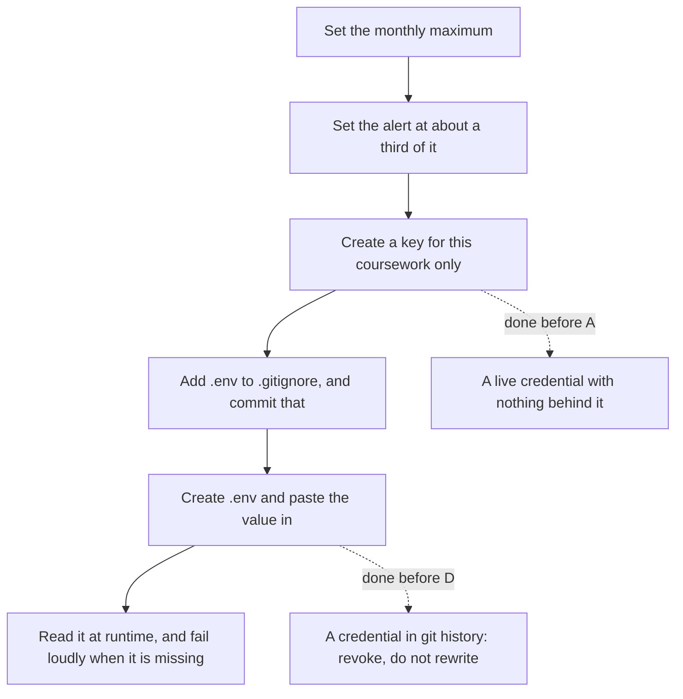

# Unit 0.3: One-click Docker environment setup and provider keys

::: phase learn

Environment friction is the most common reason people stop in week one. Not the concepts: the two hours lost to a native build failure before writing a line of pipeline code. This unit removes that. You end it with a containerized Python 3.12 workspace, provider keys loaded from the environment behind a hard spend ceiling, and a test that proves the setup works.

## Why the environment ships with the code

### The environment is part of the code

"Works on my laptop" is not a personality flaw, it is a missing artifact. If the environment is something you assembled by hand over a few weeks, nobody else can reproduce your result, including you in three months.

Three divergences cause most of the damage:

- **Resolution differences.** Two machines resolving `pydantic>=2` on different days get different versions. A minor release changes a validation default, and your extractor starts accepting input it used to reject.
- **Native builds.** Many packages ship compiled extensions. A wheel exists for your architecture or it does not, and when it does not, you are debugging a C compiler instead of your pipeline.
- **Ambient access.** On your laptop, a test that forgot to mock a provider call still passes, because your machine has network and a key in its environment. The test is not testing what you think it is.

Containerizing fixes all three at once. The interpreter version, the pinned dependencies, and the absence of network access stop being properties of your machine and become properties of the repository. Anyone who clones it gets the same behaviour, and so does the grader.

Reproducible means pinned. `pydantic>=2.0` says what you hope for. `pydantic==2.9.2` says what you tested. Pin exact versions in a requirements file or lockfile and commit it. Ranges are how a build becomes a coincidence.

### An unbounded key is a financial liability

A provider key is not a password. It is a payment instrument with no upper limit until you set one.

The code you write in this curriculum includes retry loops, batch jobs over document sets, and later on agents that decide for themselves how many calls to make. Every one of those is a program that can spend money in a loop. A retry with no backoff against a provider that is timing out will happily bill you for a thousand failed attempts. An agent with a broken stopping condition will keep calling until something stops it. If nothing stops it, the bill is the stopping condition.

So set the ceiling before you write the first call, not after the first surprise.

- **A hard cap at the provider.** Both major providers let you set a monthly spend limit on the account or project. Set one you would be willing to lose. For this curriculum, ten to twenty dollars a month is generous.
- **A separate key per project.** One key for coursework, nothing else. If it leaks, you revoke one key and nothing else in your life breaks.
- **A billing alert well below the cap.** The cap protects your bank account. The alert tells you a loop is misbehaving while there is still time to read the logs.

> **Gotcha: the retry that bills you twice**
> A request that times out on your side may have completed on theirs. You are billed for the tokens the provider generated, whether or not you read the response. Retrying a timeout is often correct, but budget for it: three attempts on a long document is three times the cost, not one.

### Keys go in the environment, never in the repo

A key committed to git is not fixed by deleting it in the next commit. It stays in history, and history is what gets pushed and cloned. Providers scan public repositories for their own key formats, and so do people who are not providers.

The rule is short: secrets are read from environment variables at runtime, and the file holding them locally is excluded from version control before it is created. What lives in the repo is an example file with the variable names and no values, so the next person knows what to set without being handed your credentials.

If you do commit a key, do not try to rewrite history first. Revoke it at the provider, immediately, then clean up. A revoked key in a public log is harmless. A live one is not.

## The container you build against

### The container your submitted code runs inside

When you submit a unit, the automated checks run your tests in a container that is deliberately small and deliberately hostile. These are the limits it enforces:

| Constraint | Value |
| --- | --- |
| Base image | Python 3.12 on Alpine, or an image carrying `pytest` and `pydantic` for units whose checks need them |
| Memory | 256 MB, with swap capped at the same figure |
| CPU | Half a core |
| Wall clock | 10 seconds per check by default |
| Network | None. No DNS, no egress, no localhost outside the container |
| Filesystem | Read-only root, plus two 64 MB scratch mounts at `/tmp` and the working directory |
| Your submission | Mounted read-only |
| User | Non-root, with all Linux capabilities dropped and a 64 process ceiling |
| Captured output | The last 4000 characters of combined stdout and stderr |

Every one of those numbers is a constraint on the code you write, not trivia about our infrastructure.

### What the limits mean for your code

**No network means every provider call in a test is mocked.** Not "should be mocked". A live call does not fail slowly with a timeout, it fails immediately with a DNS error, because there is no resolver. If your test suite passes locally and dies here, an unmocked call is the first thing to look for. This is a feature: it makes it impossible to ship a test that only passed because your laptop had a key in its environment.

**10 seconds is the budget for the whole check.** That is generous for parsing and validation and unforgiving of anything that sleeps, polls, or loads a large model. Keep fixtures to the smallest input that still exercises the behaviour. Twenty short documents prove a schema holds. Two thousand prove you did not read this section.

**256 MB is smaller than most people expect.** Reading a large file into a list of strings, then building a second list of parsed objects from it, doubles the peak. Stream where you can. When a check reports that the container ran out of memory, it is reporting a real defect in how the code handles input size, not an unfairly tight cage.

**The root filesystem is read-only and your submission is read-only.** Code that writes output next to its source will raise a permission error. Write to `/tmp` instead, and treat any file you create as scratch that disappears when the check ends. Nothing your code writes is preserved or graded. Only the test results are.

**Only the tail of your output survives.** A check that prints a progress line per record will bury its own failure message beyond the 4000 character window. Print the assertion, not the loop.

### The failure states you will actually see

A check comes back with one of a small set of outcomes, and each one points somewhere specific.

- **Timeout.** The code did not finish in the wall-clock budget. Usually a live network call, an unbounded retry loop, or a fixture far larger than the check needs.
- **Out of memory.** Peak usage crossed the cap. Usually whole-file reads or an accumulating list that never gets released.
- **Killed.** The process was terminated by the environment rather than exiting on its own. Usually the process ceiling, hit by code that spawns workers.
- **Error.** The container could not start or the command could not be run at all. Usually a missing dependency or a path that exists only on your machine.

None of these are verdicts on your understanding. They are the container telling you which assumption about the environment was wrong.

### Checkpoint

> **Predict, then check.** A student's extraction tests pass on their laptop in 4 seconds. Submitted, the same suite comes back as a timeout. They change nothing about the logic, mock the provider client, and it passes in under a second.
>
> What was the original suite actually measuring?

Provider latency, mostly. The test was making real calls, so its runtime was a property of someone else's service rather than of the code under test. It passed locally because the laptop had network and a key, and it was slow for the same reason. Mocking did not make the code faster, it made the test honest about what it covers.

## Setting it up, step by step

### Python 3.12 and pinned dependencies

Install Python 3.12 to match the grading container. Then pick one dependency tool and stay with it.

`uv` is the faster option and resolves in a single step:

```bash with uv
uv venv --python 3.12
uv pip install pydantic pytest python-dotenv
uv pip freeze > requirements.txt
```

`pip` with the standard library's `venv` works identically at a slower pace:

```bash with pip and venv
python3.12 -m venv .venv
source .venv/bin/activate    # Windows: .venv\Scripts\activate
pip install pydantic pytest python-dotenv
pip freeze > requirements.txt
```

Either way, `requirements.txt` is the artifact that matters, and `freeze` is what makes it exact. Commit it. Regenerate it whenever you add a dependency, and read the diff before committing so a transitive upgrade does not slip in unexamined.

### The container definition

A Dockerfile in the repo root gives you the same interpreter and the same pinned set as everyone else:

```dockerfile Dockerfile
FROM python:3.12-alpine
WORKDIR /work
COPY requirements.txt .
RUN pip install --no-cache-dir -r requirements.txt
COPY . .
CMD ["python", "-m", "pytest", "-q"]
```

Build it once, then run your suite inside it:

```bash
docker build -t keel-dev .
docker run --rm keel-dev
```

If you prefer to work inside the container rather than shell into it, add a `.devcontainer/devcontainer.json` pointing at the same Dockerfile and open the folder in VS Code with the Dev Containers extension. Your editor, terminal, and test runner then all sit inside the environment you are going to be graded in. The Python and Pylance extensions are worth installing in the container as well, so type errors surface while you write rather than at submission.

You do not have to work in the container day to day. You do have to be able to run your tests in it before you submit, because that is where they run for real.

### Provider keys

Set the spend limit first. Both providers expose a billing page with a monthly maximum and an email alert threshold. Set the maximum to something you would shrug at losing, and the alert to roughly a third of it. Do this before you generate the key, so there is no window where a live key has no ceiling behind it.



Then create a key scoped to this coursework and put it in a local `.env` file:

```text .env
ANTHROPIC_API_KEY=your-key-here
OPENAI_API_KEY=your-key-here
```

Add the exclusion before you create the file, not after:

```bash
echo ".env" >> .gitignore
git add .gitignore && git commit -m "Ignore local env file"
```

Commit a `.env.example` alongside it with the same variable names and empty values. That is the file that documents what needs setting.

Read keys through the environment, and fail loudly when one is missing:

```python
import os

def require_key(name: str) -> str:
    value = os.environ.get(name)
    if not value:
        raise RuntimeError(f"{name} is not set. Copy .env.example to .env and fill it in.")
    return value
```

A clear message at startup costs you one line and saves the twenty minutes it otherwise takes to work out why a client object is silently unauthenticated.

### Prove the setup works

Two tests, and they have different jobs.

```mermaid Two checks with different jobs, and only one of them belongs in the suite
flowchart LR
  A["Interpreter and dependency check"] --> B["Lives in your suite"]
  B --> C["Passes on your laptop"]
  B --> D["Passes where the checks run"]
  E["The provider ping"] --> F["Lives in scripts/"]
  F --> G["Runs on your laptop only"]
  F --> H["Needs network, so it can never be a check"]
```

The first belongs in your suite. It needs no network, so it runs anywhere, including in the grading container:

```python
import sys
import pydantic

def test_interpreter_and_deps() -> None:
    assert sys.version_info[:2] == (3, 12)
    assert pydantic.VERSION.startswith("2.")
```

The second confirms your key and your spend ceiling are real. It needs network, so it is a script you run yourself rather than a graded check:

```python scripts/ping_provider.py
import os
from dotenv import load_dotenv

load_dotenv()
print("ANTHROPIC_API_KEY set:", bool(os.environ.get("ANTHROPIC_API_KEY")))
print("OPENAI_API_KEY set:", bool(os.environ.get("OPENAI_API_KEY")))
```

Extend it with one minimal completion call against whichever provider you configured, print the response, and stop there. One short call costs a fraction of a cent and tells you the whole chain works: key present, key valid, billing active, ceiling in place.

Keep those two separate on purpose. Tests that need the internet are not tests, they are monitoring.

::: phase practice

## Reason it through before you install

Installing things is the easy half. The half that costs you an evening is reading a red check and working out which of those nine constraints it is complaining about. So we do that part first, on paper, twice.

::: route

**Which constraint bites first.** A suite reads a 40 MB fixture file into a list of dicts, parses each one into a Pydantic model, keeps both lists, and asserts on the last object. Nothing in it touches the network. Which constraint does it hit, and what is the smallest change that clears it?

One good answer: memory, at 256 MB. Two full copies of a 40 MB file go well past the cap once each record is an object rather than bytes, and the peak is both lists alive at the same time. The smallest change is not a larger allowance, it is a smaller fixture: twenty records prove a schema holds. If the input genuinely has to be that size, iterate and assert per record so only one parsed object is alive at a time.

**Order the six steps.** You have a fresh provider account and an empty repository. Put these in the order you would do them: create the credential, set the monthly maximum, create `.env`, add `.env` to `.gitignore`, set the warning threshold, read the value at runtime. Then name the two orderings that cost you real money or a revoked credential when you get them backwards.

One good answer: maximum, threshold, credential, `.gitignore`, `.env`, read. Two of those matter and the rest is preference. A credential created before the maximum exists has a window where nothing stops a retry that never gives up. A `.env` created before `.gitignore` excludes it is how a secret reaches history, where deleting it later does nothing at all.

Now read one that is already right. It is a reference-grade write up of the same three ideas, annotated with what each part earns, so read it for what a complete answer has to cover rather than for sentences to lift.

::: worked-example

Then the same synthesis with its load-bearing parts taken out, so you supply them rather than recognise them.

::: workbench

Last, close the lesson.

The drills below ask for these ideas back from memory, with the page scrolled away. Getting one wrong is not a penalty, it is how the drill works out what to put in front of you again in a few days.

::: retrieval

::: phase build

## Now set yours up

Everything above is the reasoning. This is the hour of typing. Work down the walkthrough in order, then treat the list under it as the definition of done rather than as advice.

::: deliverable

### Before you move on

- `python --version` reports 3.12 inside the container.
- `requirements.txt` is committed and contains exact versions.
- `git check-ignore .env` prints `.env`, and `git log --all -- .env` prints nothing.
- Your provider account shows a monthly spend limit and an alert threshold.
- `python -m pytest` passes inside the container, with no network.

::: submission

::: phase verify

## What a reviewer looks for

There is no code to run in this unit, so nothing goes into a container. What you submit is read against a rubric, criterion by criterion, and the reader has to quote your own words for each one. Read the criteria before you write, not after.

::: prove-it

::: grading-modes

::: rubric

::: phase unstuck

## When Docker fights you, or a secret escapes

Two things go wrong here often enough to be written down rather than left for you to find at eleven at night.

::: unstuck

If yours is neither of those, the useful question is which of the three divergences at the top of this unit you are looking at: a dependency that resolved differently, a wheel that does not exist for your architecture, or something on your machine that the repository never declared.

::: phase ask

## Ask before you lose an evening

There is an assistant on this page that has read this lesson and nothing else, so it answers about this unit's constraints and this unit's walkthrough rather than about Docker in general. Paste the error you are staring at, say what you have already tried, and ask what to look at next.

It is an AI, not a person, and it will not set your machine up for you. Once you have finished the practice route above it stops handing over answers and works questions through with you instead.

::: ask

The environment is now an artifact rather than an accident, and the key behind it has a ceiling. Every unit from here assumes both: that your tests run without network, and that a runaway loop costs you a warning email rather than a month's rent.

Phase 1 starts with Python fundamentals and data structures, written the way production pipeline code has to be written rather than the way scripts get written.
