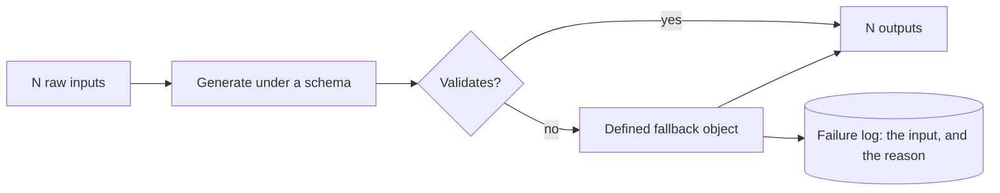

# Unit 3.2.1: Structured extraction with JSON mode and Pydantic

::: phase learn

Your Phase 2 extractor works. Feed it a merchant dispute report and it hands back a summary you can read in four seconds. That is genuinely useful, and it is also the last thing in this pipeline that a person is ever going to read.

Everything after it wants fields. The routing rule wants a claim type it can switch on. The credit calculation wants an amount it can multiply. The specialist queue wants a severity it can sort by. Not one of them can read a sentence.

So the extractor has to stop answering in prose. That part is obvious. The part that costs people a week is the next question: where does the promise to answer in fields actually get kept, and who is keeping it?

> **Predict, then check.** You add `Respond ONLY with JSON: {"claim_type": ..., "severity": ...}` to the end of your prompt and `json.loads(response)` to the end of your code. It works on the first six claims you try, so you point it at a hundred real dispute reports.
>
> How many distinct ways does it come apart?

At least five, and not one of them is the model malfunctioning. It opens with "Here is the JSON you requested:". It wraps the object in a markdown fence. It emits a trailing comma, or single quotes, or an unescaped newline inside a string. It appends "Let me know if you would like the claim number in a different format." And the expensive one: it returns valid JSON of the wrong shape, `claim_type` where your code reads `claimType`, so `json.loads` succeeds and something crashes three functions later, nowhere near the cause.

Hold on to that last one. We come back to it.

## Why free text cannot be parsed reliably by downstream systems

### What your program actually receives

A model produces a stream of tokens. When those tokens spell out English, you can read the answer. Your program is not you.

Somewhere between "the model responded" and "the row was written", some piece of code has to turn tokens into typed values: this substring is the claim type, that one is a dollar amount, this date-shaped thing is a delivery date. That conversion step is where free-text systems die, and the reason is worth saying slowly.

**Natural language is an interface built for lossy, error-correcting readers, and your program is neither lossy nor error-correcting.**

Read this the way the operations person who typed it meant it:

> two pallets crushed, looks like maybe $40k of stock, could be more once the warehouse counts it

You normalised that without noticing. Amount around 40000. Confidence low. Someone should check. A program running `response.split(":")[1]` gets the string `" maybe $40k of stock, could be more once the warehouse counts it"` and either writes it into a numeric column or raises. Neither outcome is the model's fault. The prose was never a machine interface; you used it as one.

### Why schema-constrained generation beats a prompt-promised contract

Look again at the five failures above and notice what they share. Every one is the model behaving inside normal variation for a text generator. You are not catching a model misbehaving. You are catching it behaving exactly as advertised, while you hoped it would not.

That is the real defect. With a prompt-level promise, the contract exists only as a request. Nothing enforces it, and nothing is even checking.

Here is an experiment worth running on code you have already written. Take a prompt-promised JSON extractor, run it a hundred times against one unchanged input, and count the distinct output shapes that come back: which keys are present, what type each value has. For most models and most prompts the answer is more than one. That variation is not a bug you can prompt your way out of. It is the medium.

Schema-constrained generation wins because it moves the same request out of the prose and into the API call, where the sampler is obliged to honour it. Nothing about your wording got better. The enforcement point moved.

::: aside Can I not just strip the fences and retry?
You can, and plenty of shipped code does: a regex that peels off the fence, a `try` around `json.loads`, and a second attempt with "just the object this time" bolted on.

It buys a few percentage points and costs you the thing you needed most, which is knowing which run you got. A retry loop turns a shape error into a latency spike and a larger bill, and it still cannot tell you that `estimated_amount_usd` came back as the string `"8-12k"`. Fences are the easiest failure on that list of five and the only one a regex touches. Move the contract instead, once.
:::

### Two enforcement points, and why you want both

A schema contract says: the consumer expects exactly this structure, these fields, these types, these constraints, and the interface enforces it rather than politely requesting it. There are two places to enforce it, and grown-up systems use both.

**At generation, by constraining decoding.** The provider samples the model so that only tokens satisfying the schema can be produced. This is what JSON mode and the structured-output and tool-calling APIs do.

**At ingestion, by validating.** Whatever arrives, your own code parses it against an explicit schema and gets back either a typed object or a named, typed failure. This is Pydantic's job.

Why both, when the first already sounds like a guarantee? Because they fail differently, and here the redundancy is nearly free.

Constrained generation guarantees syntax and shape against the schema **the provider saw**. That schema is almost always a subset of what you actually mean, because providers accept JSON Schema and know nothing about your business rules. Providers also change behaviour, models get swapped for cheaper ones, and proxies get misconfigured by people who are not you.

Validating at ingestion guarantees **your** definition of correct, at the boundary where data enters your system, and it hands you a failure you can act on while the offending input is still in your hand.

The mental model I would keep: **the model is an unreliable network endpoint that happens to speak fluent JSON.** You would not build a payments system that runs `eval` on whatever a third party returns. Do not build a claims pipeline that trusts whatever a model returns.

::: aside Why validate what the provider already constrained?
Because a guarantee you have not checked is a rumour, and this one has a known edge: the sampler enforces the keywords it supports and quietly ignores the ones it does not.

Send a schema with `"minimum": 0` on the amount and a strict-mode provider may honour the type and skip the bound. Your validation is where `amount >= 0` actually becomes true. It is four lines, it runs in microseconds, and it is the only part of the chain you control end to end.
:::

### Graceful degradation: fallback objects instead of silent drops

Validating forces a question the naive version never had to answer. What do you do when validation fails? There are four options, and three of them are wrong in production.

1. **Crash.** An unhandled exception takes the batch down because claim 7 of 20 was malformed. One bad input just became an availability incident.
2. **Drop it silently.** `try/except: continue`. The run reports 19 outputs for 20 inputs and nobody notices for six weeks, until an auditor asks why CLM-88231 was never credited. In distribution, in finance, in anything with a contractual audit trail, this is the worst item on the list, because it is invisible and it is data loss.
3. **Pass the bad data through.** Skip validation, forward the raw output, and garbage is now in the database wearing the costume of a validated record.
4. **Degrade gracefully.** A validation failure produces a defined fallback value: a real object in every place a real one would have gone, explicitly marked as a failed extraction, with the failure logged against the input that caused it and the reason it was rejected.

Only the fourth one ships. Learn this shape now, because it recurs in every unit from here on.



Two properties define it, and both are things you can write a test for:

- **Conservation.** N inputs produce exactly N outputs. Some may be fallbacks. Nothing vanishes.
- **Accountability.** Every fallback has a log record naming the input and the reason. Nothing vanishes quietly.

> **Predict, then check.** A nightly job extracts 20 dispute claims and writes them to the review queue. Someone wraps the extraction in `try/except Exception: continue` to stop it paging them at 3am. It works, and the job has not failed once in six weeks.
>
> What did that cost, and when does the invoice arrive?

Nineteen claims a night reach the queue and one does not exist anywhere. The cost is unreviewed merchant claims, and the invoice arrives when a merchant stops paying against an account or a rebate deadline expires, whichever comes first, and then a second time when somebody has to reconstruct six weeks of dropped records out of provider logs. The exception was never the problem. The silence was.

**A fallback is not a hack.** It is a decision that "I could not extract this claim" is information about the claim, representable in your schema, rather than an error in your program. Unit 3.2.2 builds directly on this: the `needs_human_review` flag you add there is this fallback made permanent and honest.

### The version you should be able to say out loud

Free-text model output cannot be parsed reliably by downstream systems, because parsing it means trusting a promise that only ever existed in a prompt. Move the contract into the interface: constrain generation with a schema, then validate ingestion against a schema enforced by your own code, at the boundary. When validation fails, and over enough messy input it will, degrade gracefully. Emit a defined fallback object, log the failure with its input and its reason, and keep the count honest. N inputs, N outputs, zero silent drops.

::: recap The contract in one line
Free text is unparseable because the promise lives only in prose. Move it into the interface: constrain generation with a schema, validate ingestion with your own code at the boundary, and for every failure emit a logged fallback. That keeps N inputs → N outputs with zero silent drops.
:::

## The same idea on OmniSupply's actual traffic

Concepts hold up better once you have watched one fail on real input, so here is ours.

### The contract you are building against

OmniSupply's operations team pastes merchant dispute reports into a web form. The notes read like what they are, typed by people between phone calls: typos, mixed formats, missing fields, and the occasional note that is not a claim at all. Your Phase 2 extractor reads one and summarises it. What you are building now is `extract_claim(record)`, which returns a typed, validated object every single time.

```python extract_claims.py
from datetime import date
from pydantic import BaseModel

class ClaimExtraction(BaseModel):
    claim_id: str
    claim_type: str                    # damage | shortage | overbilling | late_delivery | other
    severity: str                      # low | medium | high
    estimated_amount_usd: float | None = None
    delivery_date: date | None = None
    extraction_failed: bool = False    # look at these two
    failure_reason: str | None = None  # they are the whole trick
```

Those last two fields are the fallback, encoded in the schema, and they are the idea worth stealing from this unit. A fallback is not `None` and it is not an exception. It is a first-class value of the output type. Every consumer of a `ClaimExtraction` can check `extraction_failed` without knowing the first thing about how the extraction happened, or that a model was involved at all.

You refine this model in 3.2.2. For now it is the contract.

### The path one claim takes

```mermaid How one claim moves from a raw record to either a validated object or a logged fallback.
flowchart TB
  RAW["Raw dispute record"] --> PROMPT["Prompt: the task, and what the values mean"]
  PROMPT --> CALL["Provider call with structured output"]
  CALL --> VALIDATE["ClaimExtraction.model_validate"]
  VALIDATE -->|"valid"| OK["ClaimExtraction"]
  VALIDATE -->|"ValidationError"| FALLBACK["Fallback ClaimExtraction, extraction_failed=True"]
  FALLBACK --> LOGGED[("One log line, keyed by claim_id")]
```

Three of those boxes are doing work worth naming:

- **The prompt is still needed.** The model has to know what to extract, and what "high" means for a severity on this traffic.
- **The provider call is the contract at generation.** Decoding is constrained to the schema's shape, so what comes back is an object rather than prose.
- **`model_validate` is the contract again, enforced by you**, with your rules rather than the provider's: amount at or above zero, real dates, `claim_id` taken from the input record instead of from the model.

### One claim that fails, walked through

One of the twenty notes in this unit's corpus reads close to this:

> CLM-20841, two pallets of kettles crushed under a freight strap, merchant says most of the cartons are unsellable. Probably 8-12k?? delivered 3rd. dock photos pending

Watch each enforcement point do exactly its own job and no more.

- **The generation constraint** guarantees an object comes back rather than prose or a fenced block. That part holds.
- The model returns `{"estimated_amount_usd": "8-12k"}`, a string, because the amount genuinely is ambiguous and a string is the only honest way to say "8-12k". Syntax valid, shape wrong.
- **Pydantic rejects it.** `estimated_amount_usd` has to be a number or null. This is not the system failing, this is the system working. A claim whose amount is genuinely unknown must not quietly become `10.0` because something split the difference, and it must not take the other nineteen claims down with it either.
- **Your fallback path** builds `ClaimExtraction(claim_id="CLM-20841", claim_type="damage", severity="medium", estimated_amount_usd=None, extraction_failed=True, failure_reason="estimated_amount_usd: Input should be a valid number")` and writes one line to the log:

```text
2026-08-21T14:03:11 FALLBACK claim_id=CLM-20841 reason='estimated_amount_usd: Input should be a valid number'
```

Twenty in, twenty out, one of them flagged with its reason on record. The specialist who opens CLM-20841 sees a flagged extraction and a note about the amount, instead of a crash, a gap, or a confident number nobody can source.

### Why OmniSupply cares about this specifically

Every merchant claim is money OmniSupply either owes or does not owe, under a supplier contract somebody can be asked to produce. Drop a malformed claim silently and the claim still exists out in the world. It is just a claim nobody has looked at. That is how merchants stop paying against a whole account, and how rebate deadlines expire with nobody watching.

So "fail per record, never in silence" is not a style preference in this domain. It is the line between a demo and something an operations team would let near production. The bar on your deliverable, twenty texts in and twenty valid objects out with failures logged rather than dropped, is that property written down as a number.

### What you are reusing from earlier phases

- **2.4.2, the provider abstraction.** Your multi-model wrapper is where the structured-output call plugs in. One config change to swap models, and the same schema contract on both sides of the swap.
- **1.5.1, pytest.** Conservation is a test and you are the one who writes it. A property you have not tested is a property you do not have.

## The APIs and patterns you will actually type

<!-- FRESHNESS-AUDITED LAYER: The APIs, library versions, and code patterns in this
     section are current as of last_verified.tool_specifics above. Provider APIs
     change; this section is re-audited quarterly and MUST NOT be assumed correct
     past its audit date. The concept core and applied context layers do not have
     this problem. -->

Everything below is what you type today, and it is the part with a shelf life. The API surfaces named here will drift. The contracts they implement, constrain generation, validate ingestion, degrade gracefully, will not. When something here stops matching the current provider docs, trust the contract and update the call.

### JSON mode vs structured outputs: what each actually guarantees

Every major hosted provider offers some form of schema-constrained generation, and the offerings fall into two families that guarantee genuinely different things. Knowing which one you are holding is the difference between a boundary and a hope.

**JSON mode** constrains the model to emit syntactically valid JSON, and no particular schema. You get "guaranteed parseable". You do not get "guaranteed the right shape". Wrong keys and a string where you wanted a number both still happen, and validation is still the thing that catches them.

```python
# JSON mode family: syntax only.
response = client.chat.completions.create(
    model="gpt-4o-mini",
    response_format={"type": "json_object"},   # valid JSON, nothing about keys
    messages=[{"role": "user", "content": prompt}],
)
data = json.loads(response.choices[0].message.content)   # parses. shape unchecked.
```

**Structured outputs, including tool-calling used as structured output,** take a JSON Schema, either directly or as a tool definition, and constrain decoding so the result satisfies it. This is the stronger family and the default choice for a pipeline.

```python
# Schema-constrained family: shape too.
response = client.chat.completions.create(
    model="gpt-4o-2024-08-06",
    response_format={
        "type": "json_schema",
        "json_schema": {
            "name": "claim_extraction",
            "schema": CLAIM_EXTRACTION_JSON_SCHEMA,
            "strict": True,
        },
    },
    messages=[{"role": "user", "content": prompt}],
)
```

```python
# Anthropic style: a tool whose input_schema IS your schema, and forcing that tool
# so the model cannot answer any other way. The arguments arrive already shaped.
response = client.messages.create(
    model="claude-sonnet-4-5",
    max_tokens=1024,
    tools=[{
        "name": "emit_claim_extraction",
        "description": "Record the structured fields extracted from a dispute claim.",
        "input_schema": CLAIM_EXTRACTION_JSON_SCHEMA,
    }],
    tool_choice={"type": "tool", "name": "emit_claim_extraction"},
    messages=[{"role": "user", "content": prompt}],
)
data = response.content[0].input   # a dict, not a string you have to parse
```

**Name the guarantee.** Your call uses JSON mode, your code calls `json.loads` and nothing else, and back comes `{"claim_type": "damage", "estimated_amount_usd": "8-12k"}`. Which part of that response is guaranteed, and which part merely happened to work?

One good answer: the guarantee is that the bytes parse as JSON, and that is the entire promise JSON mode makes. Both keys being the ones you wanted is luck. `claim_type` holding one of your five permitted values is luck. `estimated_amount_usd` arriving as a string rather than a number is JSON mode working exactly as documented. Nothing in that response is wrong by its own contract. It is wrong by yours, and yours is not being checked anywhere.

### The notes that bite people

- **Strict mode has rules.** OpenAI's `strict: True` wants `additionalProperties: false` on every object and every field listed in `required`, so a genuinely optional field becomes a nullable union rather than an absent key. It supports a subset of JSON Schema keywords, and a constraint like `minimum` may be ignored by the sampler even when accepted. That is one more reason your own validation stays.
- **Enum-constrain your categoricals.** Put `claim_type` in the schema as an enum of your five values and `"FREIGHT DAMAGE"` never reaches Pydantic at all. Free-form strings for a closed set is a decision to do the cleanup later, by hand.
- **The prompt still carries meaning.** The schema says what shape to emit. The prompt says what the values mean: `severity: high` means the merchant cannot sell the shipment at all, not just that the number is large. Constrained decoding fixes the shape of an answer and never the correctness of its contents.
- **With JSON mode you still describe the keys in the prompt,** because nothing else tells the model what to call them. With a schema-constrained API you can keep the prompt about meaning only, which is a genuine simplification of the prompt.
- **Local servers do this too.** Open-weight models served through vLLM or Ollama generally expose a `json_schema` or `guided_json` parameter implementing the same constraint. The parameter name varies by server. The contract does not.

### One schema, both enforcement points

Write the schema once, as a Pydantic model, and derive the JSON Schema you hand the provider from it.

```python extract_claims.py
from datetime import date
from typing import Literal
from pydantic import BaseModel, ConfigDict, Field

class ClaimExtraction(BaseModel):
    model_config = ConfigDict(extra="forbid")

    claim_id: str
    claim_type: Literal["damage", "shortage", "overbilling", "late_delivery", "other"]
    severity: Literal["low", "medium", "high"] = "medium"
    estimated_amount_usd: float | None = Field(default=None, ge=0)
    delivery_date: date | None = None
    extraction_failed: bool = False
    failure_reason: str | None = None

# Generated, never hand-maintained. This is what goes into the provider call.
CLAIM_EXTRACTION_JSON_SCHEMA = ClaimExtraction.model_json_schema()
```

Hand-maintain a JSON Schema and a Pydantic model side by side and they will drift apart. The drift always surfaces in production, because production is the only place both are exercised against real input at the same time.

### Pydantic v2: model_validate as an enforcement boundary

`model_validate` is the call to internalise, and it helps to stop reading it as a dataclass constructor. It is a boundary. On the far side of it everything is typed and checked; on this side, nothing is.

```python extract_claims.py
from pydantic import ValidationError

try:
    extraction = ClaimExtraction.model_validate(data)
except ValidationError as exc:
    # exc.errors() returns dicts with loc, msg, type and input. Join them into
    # something a human reading the log can act on.
    reason = "; ".join(
        f"{'.'.join(str(p) for p in e['loc'])}: {e['msg']}" for e in exc.errors()
    )
```

Four behaviours worth knowing before you rely on it:

- `ConfigDict(extra="forbid")` refuses unexpected keys, so a model that helpfully adds `"confidence"` fails loudly instead of having the field dropped on the floor.
- `Field(default=None, ge=0)` puts a business rule in the schema rather than in an `if` statement three functions downstream. The schema is where rules belong, because it is the thing every caller already goes through.
- Pydantic v2 coerces by default. The string `"40000"` becomes `40000.0`, which is usually what you want from a model. When it is not, say so on purpose with `ConfigDict(strict=True)` and get a validation error instead of a silent conversion.
- `model_validate_json(text)` parses and validates in one step and is the better call when you are holding a JSON string. `TypeAdapter(list[ClaimExtraction])` validates a whole batch at once. `model_dump()` and `model_dump_json()` take you back out to plain data.

### Fallback and logging, end to end

```python extract_claims.py
import json
import logging
from pydantic import ValidationError

logger = logging.getLogger("omnisupply.extraction")

FALLBACK_TEMPLATE = "FALLBACK claim_id=%s reason=%r"

def extract(record: dict) -> ClaimExtraction:
    """One record in, one ClaimExtraction out. Never raises, never returns None."""
    raw = call_model(record["notes"])            # your 2.4.2 provider wrapper
    try:
        data = json.loads(raw)
        data["claim_id"] = record["claim_id"]    # id comes from the input, not the model
        return ClaimExtraction.model_validate(data)
    except (json.JSONDecodeError, ValidationError) as exc:
        reason = str(exc)[:500]
        logger.error(FALLBACK_TEMPLATE, record["claim_id"], reason)
        return ClaimExtraction(
            claim_id=record["claim_id"],
            claim_type="other",
            extraction_failed=True,
            failure_reason=reason,
        )
```

Notice where `claim_id` comes from. The input record, never the model. That single line is what makes conservation checkable, because it means you can always say which input produced which output, including for the outputs that failed.

And here is the bar turned into a property, using pytest from 1.5.1:

```python tests/test_build.py
def test_twenty_in_twenty_out_no_silent_drops(messy_claims):
    results = [extract(record) for record in messy_claims]     # 20 messy inputs

    assert len(results) == 20                                  # conservation
    assert all(isinstance(r, ClaimExtraction) for r in results)

    failed = [r for r in results if r.extraction_failed]
    # accountability: every fallback names itself and says why
    assert all(r.failure_reason and r.claim_id for r in failed)
```

::: aside Where does the retry go, then?
Not inside `extract`. A retry belongs one level up, driven by the log, where it can be rate-limited, capped, and counted.

The moment `extract` retries internally it stops being a function of its input, its latency becomes unpredictable, and the fallback rate you measure stops meaning anything. Keep the boundary honest: one input, one output, one log line when it degrades. Whether a failed claim gets a second attempt is a decision for whatever owns the batch, not for the function that validates a single record.
:::

::: phase practice

## Working one before you build one

You know what has to be true now. Knowing it and typing it are different skills, and the gap between them is where an evening usually goes.

So we do it once on something smaller first, where the answer already exists and you can check yourself against it, before you point any of this at your own extractor.

::: route

Read the worked example the way you would read a colleague's pull request. It is a vendor-invoice extractor: the same structure as yours, a neighbouring task, and deliberately not copyable into your deliverable. At each step, decide what you would have written before you look at what it did.

::: worked-example

Now you write the part that carries the weight. The imports, the provider call and the fixtures are already there. What is missing is the boundary: the validation, the fallback object, and the log line that makes that fallback findable a week later.

The checks that run here are the same ones that run on your submission, so a pass here means the pattern is right before you turn it loose on messier input.

::: workbench

One more thing before you build, and this one asks you to close the lesson.

The drills below want the ideas back in your own words, from memory, with nothing in front of you. That feels harder than re-reading because it is harder, and that is the point. Retrieval is what moves an idea from "I followed that" to "I can use that at eleven at night when something is broken". Anything you get wrong comes back to you in a few days.

::: retrieval

::: phase build

## Your extractor, on twenty real reports

That was a vendor invoice, and it was tidy. Yours is a merchant dispute report typed between phone calls, and there are twenty of them waiting.

::: deliverable

Same pattern, harder input. The corpus is doing the real work here: it holds claims with ambiguous amounts, claims missing a delivery date, and at least one note that is not a claim at all. If your extractor returns twenty valid objects against that, the pattern holds and you own it.

::: submission

::: phase verify

## How this gets graded

Read this part before you write a line of the deliverable. I would rather you know exactly where the bar is than guess at it and find out at submission.

::: prove-it

::: grading-modes

The checks below are the ones that run against your commit, verbatim. Nothing is held back, and you can run every one of them locally and get the same answer.

::: checks

The rubric is the document a reviewer works from, criterion by criterion. There is nothing behind it.

::: rubric

::: phase unstuck

## When it breaks

Three things break here, and they break for almost everybody, so they are written down rather than left for you to find at midnight.

::: unstuck

If yours is not on that list, the way back is usually mechanical. Run the checks locally. Read the first failure in full rather than the last one. And print the raw provider response before it reaches `model_validate`, because most of the confusion in this unit turns out to be a shape nobody has actually looked at.

::: phase ask

## Ask about this unit

There is an assistant on this page that has read this lesson and nothing else, so it answers about invoice extraction and validation boundaries rather than about programming in general. Ask why something works, ask for another exercise, or paste an error and say what you expected instead.

It is an AI, not a person, and it will not write your deliverable. Once you have finished the practice route above it stops handing over answers and works questions through with you instead, which is irritating at the time and is the only version of this that leaves you able to do the work.

::: ask
